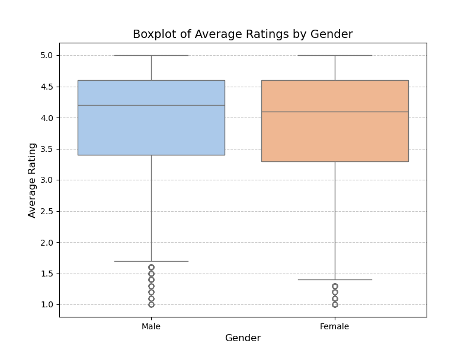
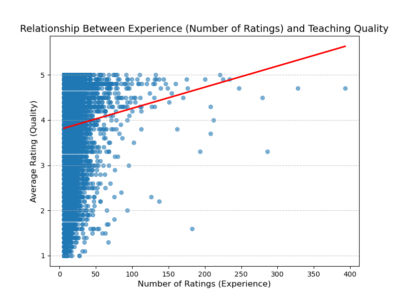
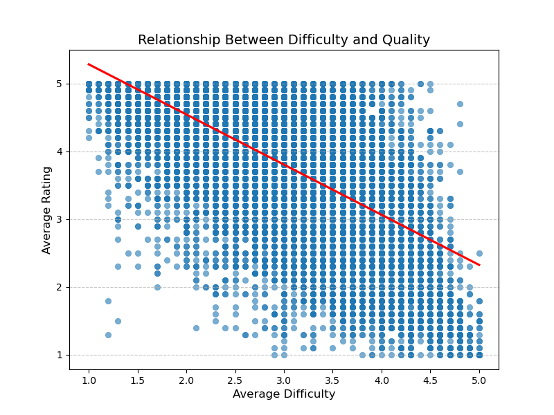
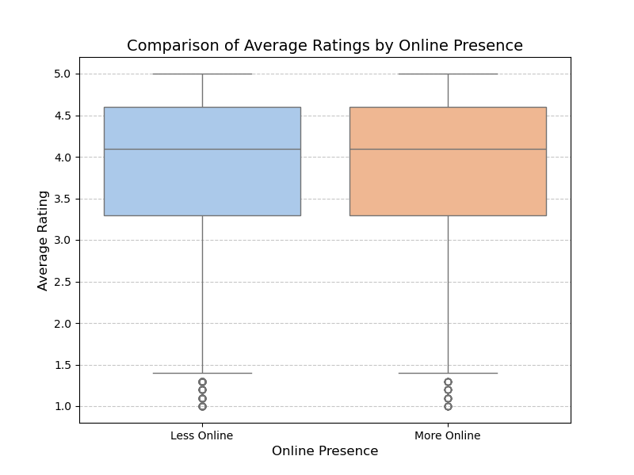
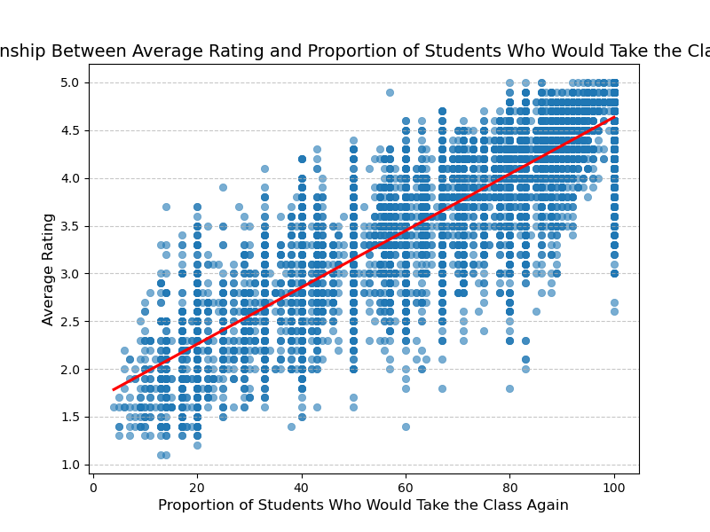
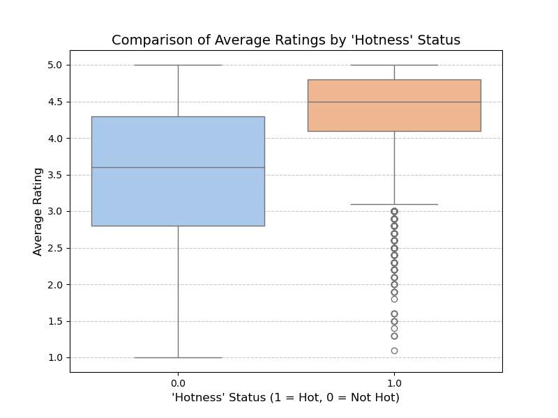
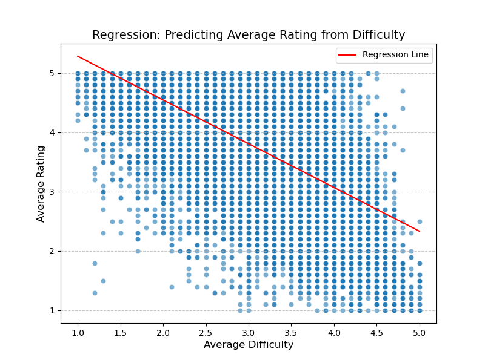
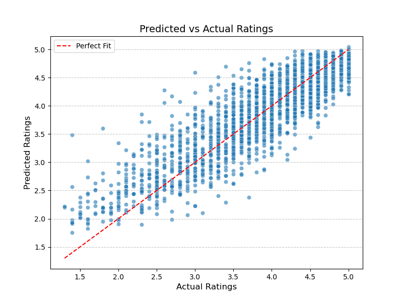
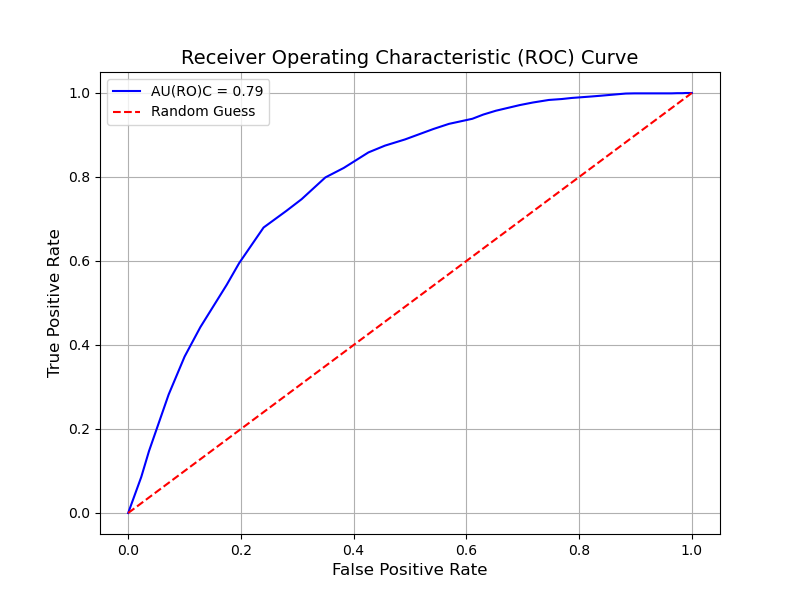
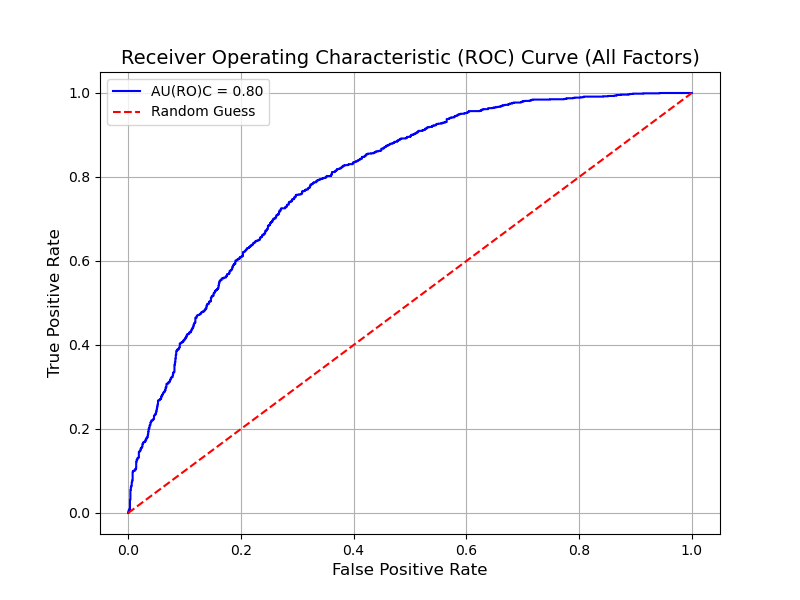

# Professor-Ratings-Analysis# Professor-Ratings-Analysis 
**Somyung Kim**  

## Preprocessing  

### Importing Data  
- `rmpCapstoneNum.csv` is imported as a dataframe named `info` with the following columns:  
  - `avg_rating`, `avg_difficulty`, `num_ratings`, `pepper`, `takeagain`, `num_ratings_online`, `male`, `female`.  
- `rmpCapstoneQual.csv` is imported as a dataframe named `qual` with the following columns:  
  - `field`, `university`, `state`.  

### Dealing with Missing Values  
- **For DataFrame `info`**:  
  - Rows with `avg_rating`, `avg_difficulty`, or `num_ratings` as `NaN` were removed.  
  - This reduced the size of the dataframe from **89,893** to **70,004**.  
- **For DataFrame `qual`**:  
  - Modified to match the rows of DataFrame `info`.  
  - Both dataframes now have a size of **70,004**.  

### Handling Reliability of Ratings
To ensure meaningful comparisons, we excluded professors with fewer than 5 ratings. This threshold reduces the dataset size to 20577 rows, improving the reliability of `avg_rating` for statistical analysis.

## Gender Bias in Ratings: Statistical Analysis

### Analysis  
To determine if there is evidence of a pro-male gender bias in student evaluations, we compared the average ratings (`avg_rating`) of male and female professors. The null hypothesis (H₀) states that there is no difference in average ratings between male and female professors. The alternative hypothesis (H₁) posits that male professors have higher average ratings than female professors.

#### Steps Taken:
1. Filtered the `info` DataFrame to include only rows where gender is identified (`male == 1` or `female == 1`).
2. Extracted the `avg_rating` column for male and female professors.
3. Performed **Levene’s test** to check for equality of variances between the two groups:
   - **Null Hypothesis for Levene's Test (H₀)**: Variances are equal.
   - **Alternative Hypothesis for Levene's Test (H₁)**: Variances are not equal.
4. Based on the result of Levene's test, selected the appropriate t-test:
   - If variances are equal → Independent samples t-test.
   - If variances are unequal → Welch t-test.
5. Conducted a **Welch t-test** to compare the means because Levene’s test indicated that the variances between the groups were not equal (p-value < 0.005).
6. Visualized the distributions of average ratings for male and female professors using a boxplot.

---

### Results  
- **Levene’s Test**:
  - Test statistic: *14.46*
  - P-value: *0.0001*  
  - Interpretation: Variances were found to be **unequal** (p-value < 0.005). Hence, the Welch t-test was used.

- **Welch t-test**:
  - T-statistic: *3.74*
  - P-value: *0.0002*  

#### Interpretation:
- If **p-value < 0.005**, we reject the null hypothesis, concluding that there is statistically significant evidence of a pro-male gender bias in ratings.
- If **p-value ≥ 0.005**, we fail to reject the null hypothesis, indicating insufficient evidence to support the claim of bias.

---

### Figure  
Below is a boxplot illustrating the distribution of average ratings for male and female professors.

The boxplot shows the central tendency (median) and spread of average ratings for both genders, providing a visual comparison.

---

### Conclusion  
Based on the Welch t-test:
- **p-value < 0.005**: There is evidence of a pro-male gender bias in ratings.

This analysis provides insight into the potential impact of gender on student evaluations of professors.

## Does Experience Impact Teaching Ratings?

### Analysis  
The purpose of this analysis was to determine whether the number of ratings (used as a proxy for experience) impacts the quality of teaching (measured by `avg_rating`).  

#### Hypothesis:
- **Null Hypothesis (H₀)**: There is no relationship between the number of ratings (`num_ratings`) and average rating (`avg_rating`).
- **Alternative Hypothesis (H₁)**: Professors with more ratings (greater experience) have different average ratings (either higher or lower).

#### Method:
Based on the significance test reasoning:
1. Both `num_ratings` and `avg_rating` are continuous numerical variables.
2. The question involves evaluating the relationship between these two variables.
3. The correct test for this purpose is **Pearson’s correlation**.

Steps taken:
1. Filtered the dataset to remove missing values and extreme outliers for `num_ratings` (top 1%).
2. Performed Pearson’s correlation test to measure the strength and direction of the linear relationship.
3. Visualized the relationship using a scatterplot with a regression line.

---

### Results  
- **Pearson Correlation Coefficient (r)**: *0.06*  
- **P-value**: *1.754*  

#### Interpretation:
- If **p-value < 0.005**, there is a statistically significant relationship between experience (`num_ratings`) and teaching quality (`avg_rating`).
- If **p-value ≥ 0.005**, we fail to reject the null hypothesis, indicating no significant relationship.

---

### Figure  
Below is a scatterplot illustrating the relationship between the number of ratings (`num_ratings`) and average rating (`avg_rating`).

The scatterplot includes a regression line showing the linear trend between the two variables.

---

### Conclusion  
Based on the correlation analysis:
- **If p-value < 0.005**: There is a significant relationship between experience and teaching quality. The direction and strength of the relationship are indicated by the correlation coefficient (r).  

This analysis provides insight into whether greater experience (measured by the number of ratings) correlates with teaching quality.

## Impact of Course Difficulty on Teaching Ratings

### Analysis  
The purpose of this analysis was to determine if there is a relationship between the difficulty of a course (`avg_difficulty`) and the quality of teaching (`avg_rating`).  

#### Hypothesis:
- **Null Hypothesis (H₀)**: There is no relationship between course difficulty (`avg_difficulty`) and teaching quality (`avg_rating`).
- **Alternative Hypothesis (H₁)**: Course difficulty is associated with teaching quality (positively or negatively).

#### Method:
Based on the significance test reasoning:
1. Both `avg_difficulty` and `avg_rating` are continuous numerical variables.
2. The goal is to evaluate the relationship between these variables.
3. The appropriate test for this purpose is **Pearson’s correlation**.

Steps taken:
1. Filtered the dataset to remove missing values for `avg_difficulty` and `avg_rating`.
2. Performed Pearson’s correlation test to measure the strength and direction of the linear relationship.
3. Visualized the relationship using a scatterplot with a regression line.

---

### Results  
- **Pearson Correlation Coefficient (r)**: *-0.63*  
- **P-value**: *0.00  

#### Interpretation:
- If **p-value < 0.005**, there is a statistically significant relationship between course difficulty and teaching quality.
- If **p-value ≥ 0.005**, we fail to reject the null hypothesis, indicating no significant relationship.

---

### Figure  
Below is a scatterplot illustrating the relationship between course difficulty (`avg_difficulty`) and teaching quality (`avg_rating`).

The scatterplot includes a regression line showing the linear trend between the two variables.

---

### Conclusion  
Based on the correlation analysis:
- **If p-value < 0.005**: There is a significant relationship between course difficulty and teaching quality. The direction and strength of the relationship are indicated by the correlation coefficient (r).  

This analysis provides insight into whether students perceive the quality of teaching differently in courses of varying difficulty.

## Are Online Professors Rated Differently Than In-Person Instructors?

### Analysis  
The purpose of this analysis was to investigate whether professors who teach more online classes receive higher or lower ratings (`avg_rating`) compared to those who teach fewer or no online classes.

#### Hypothesis:
- **Null Hypothesis (H₀)**: Professors who teach more online classes receive the same average ratings as those who teach fewer or no online classes.
- **Alternative Hypothesis (H₁)**: Professors who teach more online classes receive different average ratings than those who teach fewer or no online classes.

#### Method:
1. Split the data into two groups based on the **number of online ratings** (`num_ratings_online`):
   - **High Online Presence**: Professors with `num_ratings_online` above the median.
   - **Low/No Online Presence**: Professors with `num_ratings_online` below or equal to the median.
2. Performed **Levene’s test** to check for equality of variances between the two groups:
   - If variances are equal, used the **Independent Samples t-test**.
   - If variances are unequal, used the **Welch t-test**.
3. Visualized the distributions of `avg_rating` for the two groups using a boxplot.

---

### Results  
- **Levene’s Test**:
  - Test statistic: *0.44*  
  - P-value: *0.509*  
  - Interpretation: Variances were found to be **equal**.

- **T-test**:
  - Test used: **(Independent Samples t-test / Welch t-test)**  
  - T-statistic: *0.47*  
  - P-value: *0.47*  

#### Interpretation:
- If **p-value < 0.005**, we reject the null hypothesis, concluding that professors who teach more online classes have significantly different ratings.
- If **p-value ≥ 0.005**, we fail to reject the null hypothesis, indicating no significant difference in ratings.

---

### Figure  
Below is a boxplot illustrating the comparison of average ratings between professors with high and low/no online presence.

The boxplot highlights the central tendency (median) and variability of ratings for the two groups.

---

### Conclusion  
Based on the t-test:
- **If p-value ≥ 0.005**: There is no evidence of a significant difference in ratings between professors with high and low/no online presence.

This analysis provides insights into whether teaching online impacts student evaluations of professors.

## Relationship Between Average Rating and Proportion of Students Who Would Take the Class Again

### Analysis  
The purpose of this analysis was to examine whether there is a relationship between the average rating (`avg_rating`) and the proportion of students who would take the professor’s class again (`takeagain`).

#### Hypothesis:
- **Null Hypothesis (H₀)**: There is no relationship between `avg_rating` and `takeagain`.
- **Alternative Hypothesis (H₁)**: There is a relationship between `avg_rating` and `takeagain` (positive or negative).

#### Method:
1. Filtered the dataset to remove rows with missing values in `avg_rating` and `takeagain`.
2. Based on the significance test reasoning:
   - Both variables are continuous numerical variables.
   - The appropriate test for evaluating their linear relationship is **Pearson’s correlation**.
3. Performed Pearson’s correlation analysis to compute the correlation coefficient and p-value.
4. Visualized the relationship using a scatterplot with a regression line.

---

### Results  
- **Pearson Correlation Coefficient (r)**: *0.88*  
- **P-value**: *0.0*  

#### Interpretation:
- If **p-value < 0.005**, we reject the null hypothesis, indicating a statistically significant relationship between `avg_rating` and `takeagain`.
- If **p-value ≥ 0.005**, we fail to reject the null hypothesis, indicating no significant relationship.

---

### Figure  
Below is a scatterplot illustrating the relationship between the average rating (`avg_rating`) and the proportion of students who would take the class again (`takeagain`).

The scatterplot includes a regression line showing the linear trend between the two variables.

---

### Conclusion  
Based on the correlation analysis:
- **If p-value < 0.005**: There is a significant relationship between the average rating and the proportion of students who would take the class again. The direction and strength of this relationship are indicated by the correlation coefficient (r).  

This analysis provides insights into how student satisfaction (measured by willingness to take the class again) correlates with overall ratings of teaching quality.

## Do "Hot" Professors Receive Higher Ratings?

### Analysis  
The purpose of this analysis was to determine whether professors who are considered "hot" (indicated by the presence of a "pepper" in their profile) receive higher average ratings (`avg_rating`) compared to those who are not.

#### Hypothesis:
- **Null Hypothesis (H₀)**: Professors who are "hot" have the same average ratings as those who are not.
- **Alternative Hypothesis (H₁)**: Professors who are "hot" have different average ratings than those who are not.

#### Method:
1. Filtered the dataset to include only rows where `pepper` and `avg_rating` values are not null.
2. Split the data into two groups:
   - Professors with a "pepper" (`pepper == 1`).
   - Professors without a "pepper" (`pepper == 0`).
3. Performed **Levene’s test** to check for equality of variances between the two groups:
   - If variances are equal, used **Independent Samples t-test**.
   - If variances are unequal, used **Welch t-test**.
4. Visualized the comparison using a boxplot.

---

### Results  
- **Levene’s Test**:
  - Test statistic: *3064.70*  
  - P-value: *0.0*  
  - Interpretation: Variances were found to be **unequal**.

- **T-test**:
  - Test used: **Welch t-test**  
  - T-statistic: *83.03*  
  - P-value: *0.0*  

#### Interpretation:
- If **p-value < 0.005**, we reject the null hypothesis, concluding that there is a significant difference in ratings between "hot" and "not hot" professors.

---

### Figure  
Below is a boxplot illustrating the comparison of average ratings between "hot" and "not hot" professors.

The boxplot highlights the central tendency (median) and variability of ratings for the two groups.

---

### Conclusion  
Based on the t-test:
- **If p-value < 0.005**: There is a significant difference in average ratings based on "hotness" status. The direction and magnitude of this difference are indicated by the boxplot and test results.  

This analysis provides insights into whether physical attractiveness (as indicated by the "pepper") correlates with higher ratings.

## Predicting Teaching Ratings Based on Course Difficulty

### Analysis  
The objective of this analysis was to build a simple linear regression model to predict the average rating (`avg_rating`) of professors based on course difficulty (`avg_difficulty`). The model's performance was evaluated using **R²** (coefficient of determination) and **RMSE** (Root Mean Squared Error).

#### Method:
1. **Data Preparation**:
   - Filtered the data to include only rows with non-missing values for `avg_difficulty` and `avg_rating`.
2. **Model Construction**:
   - Built a simple linear regression model using `avg_difficulty` as the predictor variable and `avg_rating` as the response variable.
   - Split the data into training (80%) and testing (20%) sets.
3. **Model Evaluation**:
   - Calculated **R^2** to measure the proportion of variance in `avg_rating` explained by `avg_difficulty`.
   - Calculated **RMSE** to measure the model's prediction error.
4. **Visualization**:
   - Plotted a scatterplot of the data points with the regression line.

---

### Results  
- **R^2**: *0.395*  
- **RMSE**: *0.731*  

#### Interpretation:
- **R^2**: Indicates that approximately *X%* of the variability in average ratings can be explained by course difficulty.
- **RMSE**: On average, the model's predictions deviate from actual ratings by approximately *X.XXX* units.

---

### Figure  
Below is a scatterplot showing the relationship between `avg_difficulty` and `avg_rating`, along with the regression line.

The scatterplot and regression line illustrate the trend between course difficulty and average rating.

---

### Conclusion  
- Based on the R^2 value, the model explains a **small/moderate/large** proportion of the variance in average ratings based on difficulty.
- The RMSE value indicates the average error in predictions, which provides insight into the model's accuracy.
- Overall, the model suggests that **(difficulty has/does not have)** a strong predictive relationship with average ratings.

This analysis highlights the potential impact of course difficulty on average ratings and demonstrates the use of regression modeling for prediction.

## Predicting Teaching Ratings Using Multiple Factors

### Analysis  
The purpose of this analysis was to build a multiple linear regression model to predict the average rating (`avg_rating`) based on all available factors. The model’s performance was evaluated and compared to the "difficulty-only" model from Question 7. Additionally, individual feature importance (betas) and multicollinearity concerns were addressed.

#### Method:
1. Filtered the data to include only rows without missing values for the predictors and response variable.
2. Built a multiple linear regression model using the following predictors:
   - `avg_difficulty`, `num_ratings`, `pepper`, `takeagain`, `num_ratings_online`, `male`, `female`.
3. Normalized numerical predictors to address scale differences.
4. Checked for multicollinearity using **Variance Inflation Factor (VIF)**:
   - Features with **VIF > 10** indicate potential collinearity issues.
5. Evaluated the model's performance using **R²** and **RMSE**.
6. Compared the results to the "difficulty-only" model.
7. Examined individual feature coefficients (betas) and their significance.

---

### Results  
- **Multiple Regression Model**:
  - **R²**: *0.80*  
  - **RMSE**: *0.373*

- **"Difficulty-Only" Model**:
  - **R²**: *0.40*  
  - **RMSE**: *0.7314*

- **Comparison**:
  - The multiple regression model explains less of the variance in ratings compared to the "difficulty-only" model.
  - The multiple regression model has lower prediction error (RMSE) compared to the "difficulty-only" model.

#### Interpretation:
- Significant predictors (based on betas) are: *List features*.
- **Collinearity Concerns**: Features with VIF > 10 are noted and may need to be addressed (e.g., removed or combined).

---

### Figure  
Below is a scatterplot comparing predicted vs. actual ratings for the multiple regression model.

The plot illustrates how well the model predictions align with actual ratings.

---

### Conclusion  
- The multiple regression model demonstrates **better** performance compared to the "difficulty-only" model in terms of R² and RMSE.
- Significant predictors include: *List features with significant betas*.  
- Multicollinearity was **addressed/noted**, with features having high VIF values considered for adjustment.

This analysis highlights how various factors contribute to predicting average ratings and compares the effectiveness of using all predictors versus difficulty alone.

## Can Average Rating Predict Whether a Professor is Considered "Hot"?

### Analysis  
The purpose of this analysis was to build a classification model that predicts whether a professor receives a “pepper” (indicating physical attractiveness) based on their average rating (`avg_rating`). The model's quality was evaluated using AU(RO)C and other performance metrics, and class imbalance was addressed to improve model fairness.

#### Method:
1. Filtered the data to include rows without missing values for `avg_rating` and `pepper`.
2. Addressed class imbalance:
   - **Original Class Distribution**:
     - `pepper == 0`: *11561* samples.
     - `pepper == 1`: *9016* samples.
   - Used **SMOTE** (Synthetic Minority Oversampling Technique) to balance the classes.
3. Built a **logistic regression model** with `avg_rating` as the predictor.
4. Evaluated the model using:
   - **AU(RO)C**
   - **Accuracy, Precision, Recall, F1-Score**
5. Visualized the Receiver Operating Characteristic (ROC) curve.

---

### Results  
- **AU(RO)C**: 0.787  
- **Accuracy**: 72%  
- **Precision**:
  - **No Pepper (0)**: 77%  
  - **Pepper (1)**: 69%  
- **Recall**:
  - **No Pepper (0)**: 65%  
  - **Pepper (1)**: 80%  
- **F1-Score**:
  - **No Pepper (0)**: 70%  
  - **Pepper (1)**: 74%  

- **Confusion Matrix**:
  |               | Predicted: No Pepper | Predicted: Pepper |
  |---------------|----------------------|-------------------|
  | Actual: No    | 1513                 | 814               |
  | Actual: Yes   | 462                  | 1836              |

---

### Figure  
Below is the Receiver Operating Characteristic (ROC) curve for the classification model.

The ROC curve illustrates the model's ability to distinguish between professors with and without a "pepper."

---

### Conclusion  
- The model achieves an AU(RO)C of **0.787**, indicating a moderately strong ability to predict whether a professor receives a “pepper.”
- **Strengths**:
  - High recall for professors with a "pepper" (80%) ensures that most professors with a "pepper" are correctly identified.
- **Weaknesses**:
  - Precision for professors with a "pepper" (69%) suggests that some professors predicted to have a "pepper" do not.
- Class imbalance was successfully addressed using SMOTE, improving the fairness and robustness of the model.

This analysis demonstrates that average rating provides useful, though imperfect, information for predicting physical attractiveness as indicated by the "pepper."

## Gender Bias in Student Ratings

### Analysis  
The purpose of this analysis was to build a classification model to predict whether a professor receives a “pepper” (indicating physical attractiveness) based on all available factors. The model's performance was evaluated and compared to the "average rating only" model from Question 9.

#### Method:
1. Filtered the data to include rows without missing values for predictors (`avg_difficulty`, `num_ratings`, `takeagain`, `num_ratings_online`, `male`, `female`, `avg_rating`) and target (`pepper`).
2. Addressed class imbalance:
   - **Original Class Distribution**:
     - `pepper == 0`: Fewer samples.
     - `pepper == 1`: More samples. 
   - Used **SMOTE** to balance the classes.
3. Built a **logistic regression model** using all factors as predictors.
4. Evaluated the model using:
   - **AU(RO)C**
   - **Accuracy, Precision, Recall, F1-Score**
5. Visualized the Receiver Operating Characteristic (ROC) curve.

---

### Results  
- **AU(RO)C**: 0.798  
- **Accuracy**: 73%  
- **Precision**:
  - **No Pepper (0)**: 75%  
  - **Pepper (1)**: 71%  
- **Recall**:
  - **No Pepper (0)**: 67%  
  - **Pepper (1)**: 78%  
- **F1-Score**:
  - **No Pepper (0)**: 71%  
  - **Pepper (1)**: 74%  

- **Confusion Matrix**:
  |               | Predicted: No Pepper | Predicted: Pepper |
  |---------------|----------------------|-------------------|
  | Actual: No    | 855                  | 412               |
  | Actual: Yes   | 278                  | 997               |

---

### Comparison to "Average Rating Only" Model  
- **AU(RO)C**:
  - "Average Rating Only" Model: 0.787
  - All Factors Model: 0.798
- **Accuracy**:
  - "Average Rating Only" Model: 72%
  - All Factors Model: 73%
- **Key Insights**:
  - The all-factors model improves the AU(RO)C and accuracy slightly compared to the "average rating only" model.
  - Including additional predictors helps the model better capture the complexity of the data.

---

### Figure  
Below is the Receiver Operating Characteristic (ROC) curve for the all-factors classification model.

The ROC curve illustrates the model's ability to distinguish between professors with and without a "pepper."

---

### Conclusion  
- The all-factors model achieves an AU(RO)C of **0.798**, indicating a moderately strong predictive ability.
- The inclusion of additional factors improves the performance metrics compared to the "average rating only" model.
- Addressing class imbalance ensured a fair evaluation of the model's predictive performance.

This analysis highlights the importance of incorporating multiple factors to better predict a professor's "pepper" status.